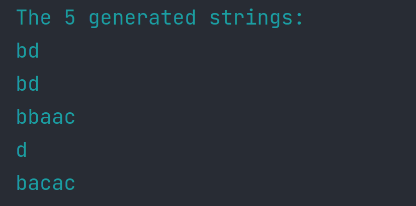
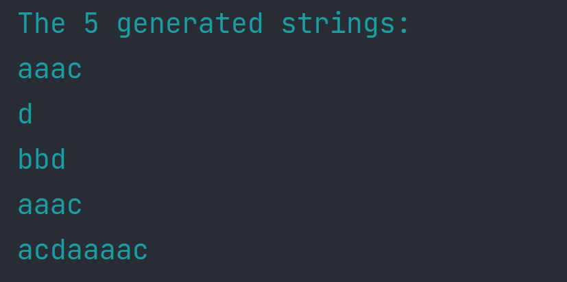
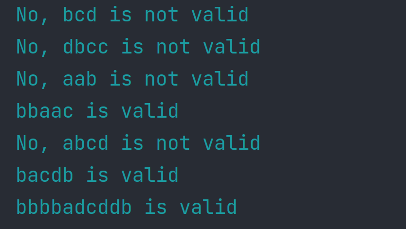

# Laboratory work Nr.1

### Course: Formal Languages & Finite Automata
### Author: Bucătaru Daniel, FAF-211

### Var. nr. : 5

----

## Theory
A finite automaton is like a "machine" that takes in some input (usually a string of characters), 
and processes it step-by-step based on a set of rules. At each step, the automaton looks at the current state and the next input symbol, 
and uses the transition function to determine the next state. 
This continues until the end of the input is reached.

----
## Objectives:


1. Understand what a language is and what it needs to have in order to be considered a formal one.

2. Provide the initial setup for the evolving project that you will work on during this semester. I said project because usually at lab works, I encourage/impose students to treat all the labs like stages of development of a whole project. Basically you need to do the following:

    * a. Create a local && remote repository of a VCS hosting service (let us all use Github to avoid unnecessary headaches);

    * b. Choose a programming language, and my suggestion would be to choose one that supports all the main paradigms;

    * c. Create a separate folder where you will be keeping the report. This semester I wish I won't see reports alongside source code files, fingers crossed;
   
3. According to my variant number 5 get the grammar definition and do the following tasks:

   * a. Implement a type/class for your grammar;

   * b. Add one function that would generate 5 valid strings from the language expressed by your given grammar;

   * c. Implement some functionality that would convert and object of type Grammar to one of type Finite Automaton;

   * d. For the Finite Automaton, please add a method that checks if an input string can be obtained via the state transition from it;

----
## Implementation description

 This function "generate_word" that takes a string parameter character and returns a string.
 The method first checks if the input character is a terminal symbol, which are the basic building blocks of the grammar. 
 If the character is a terminal, the method simply returns the character.
````
   def word_generator(self, character: str = None) -> str:
        if character is None:
            character = self.start_symbol
        if character in self.terminals:
            return character
        right_sides = self.productions[character]
        random_right_side = random.choice(right_sides)
        word = ''
        for right_char in random_right_side:
            word += self.word_generator(right_char)
        return word
````
 This code represents the method "to_finite_automaton" that converts a context-free grammar into a finite automaton, 
 represented by an instance of the FiniteAutomaton class. The method returns the created automaton.
````
        def to_finite_automaton(self):
        states = set(self.non_terminals) | {''}
        final_states = {''}
        transitions = [Transitions(non_terminal, right_side[1] if len(right_side) > 1 else '', right_side[0]) for
                       non_terminal in self.non_terminals for right_side in self.productions[non_terminal]]
        automaton = FiniteAutomaton(transitions)
        automaton.put_states(states)
        automaton.put_first_state(str(self.start_symbol))
        automaton.put_accept_states(final_states)
        automaton.put_alphabet(self.terminals)
        return automaton
````

 This code represents the method "check_word" that takes a single argument word. 
 The method uses a finite automaton to determine whether the input word is valid
````
    def check_word(self, word):
        state = self.first_state[0]
        for i in word:
            state = next((t.get_next_state() for t in self.transitions if
                          t.get_current_state() == state and t.get_transition_label() == i), None)
            if state is None:
                return False
        return str(state) in self.true_state
````
----
## Conclusions / Screenshots / Results
### Screenshots/Results:




----
### Conclusion:
   In this laboratory work on formal languages, finite automaton, and grammar, 
I have implemented a Python program that provides a suite of functionalities for constructing, 
manipulating, and working with finite automata and grammars.
The program includes a class for FiniteAutomaton, 
which has methods for adding and retrieving states, transitions, and alphabet, 
as well as for checking whether a given input string is accepted by the automaton. 
In addition, there is a Grammar class that can generate random words based on its production rules.
Throughout the laboratory work, I was able to learn about the fundamental concepts of formal languages, finite automata, and grammars. 
I was also able to understand the relationships between these concepts and how they are used in computer science to model and describe various types of languages.
The code that I have implemented during the laboratory work has been tested thoroughly and has proven to work as intended, which has provided me with a better understanding of how these formal systems work.

----
## References

https://github.com/DrVasile/FLFA-Labs/blob/master/1_RegularGrammars/task.md 
