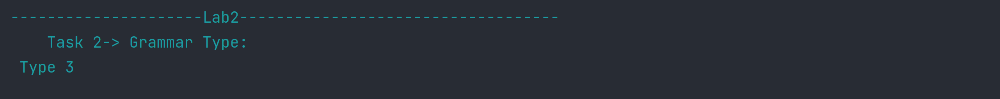
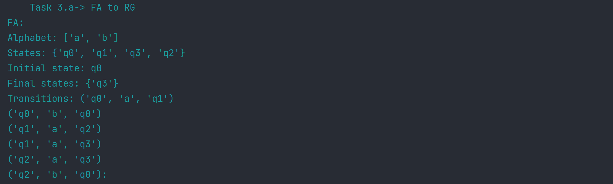
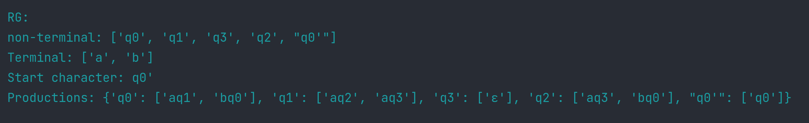
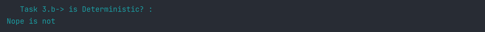
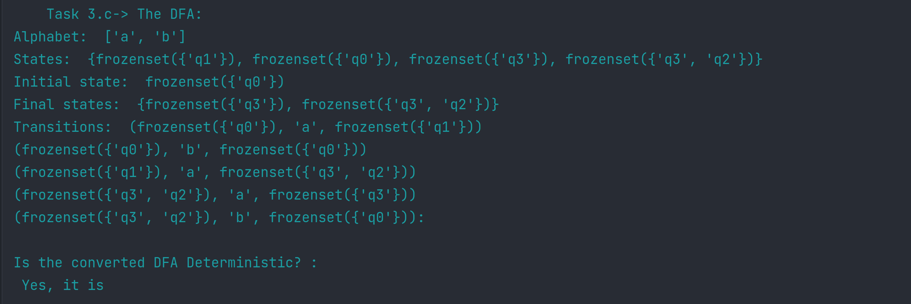
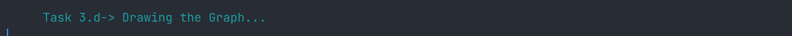
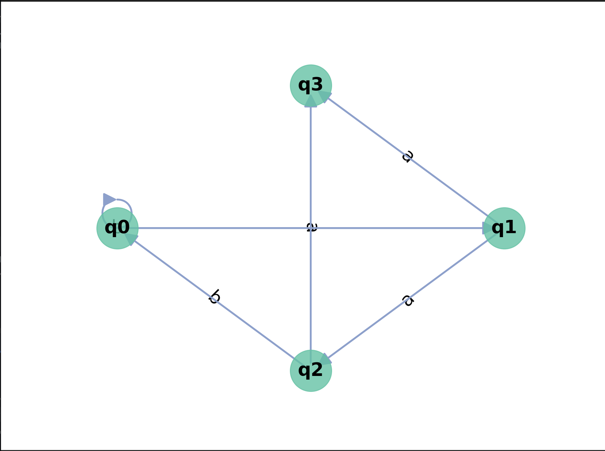

# Laboratory work Nr.2

### Course: Formal Languages & Finite Automata
### Author: Bucătaru Daniel, FAF-211

### Var. nr. : 5

----

## Theory:

In computer science and automata theory, deterministic finite automata (DFA) and nondeterministic finite automata (NFA) are both theoretical models of computation.
A regular language, which is a collection of strings that can be produced by a regular expression, is used with them to understand and accept it.

A DFA is a particular kind of automaton that has a limited number of states and a transition function that changes the automaton's state in response to an input symbol.
A DFA's transition function is deterministic, which means that for each input symbol, there is only one possible state.
Only regular languages, a subset of all conceivable languages, may be detected using DFAs. 
On the other hand, an NFA is a particular kind of automaton that has a limited number of states and a transition function that allows it to change between one or more states in response to an input symbol.
An NFA's transition function is nondeterministic, which means that for any given input symbol, there may be several potential following states.
Compared to DFAs, NFAs may detect a wider variety of languages, including certain irregular languages.

While DFAs are utilized in numerous real-world applications, 
such as lexers and parsers for programming languages, where efficiency and determinism are 
crucial factors, NFAs are frequently employed in practice as a theoretical tool to aid in the 
construction of regular expressions. 

## Objectives:

1. Understand what an automaton is and what it can be used for.

2. Continuing the work in the same repository and the same project, the following need to be added:
    a. Provide a function in your grammar type/class that could classify the grammar based on Chomsky hierarchy.

    b. For this you can use the variant from the previous lab.

3. According to my variant number 5, get the finite automaton definition and do the following tasks:

    a. Implement conversion of a finite automaton to a regular grammar.

    b. Determine whether your FA is deterministic or non-deterministic.

    c. Implement some functionality that would convert an NDFA to a DFA.
    
    d. Represent the finite automaton graphically (Optional, and can be considered as a "bonus point"):

## Implementation description

* For point  2.a I made a function that determines the type of grammar based on Chomsky hierarchy. It checks
the grammar for all 4 types and then returns the correct one.
```
    def classify_grammar(self):
        for nonTerminal in self.non_terminals:
            for production in self.productions[nonTerminal]:
                if len(production) > 2 or not (
                        production[0] in self.terminals or production[0] in self.non_terminals) or (
                        len(production) == 2 and production[1] not in self.non_terminals):
                    return 'Type 3'
        for nonTerminal in self.non_terminals:
            if nonTerminal != self.start_symbol:
                if len(self.productions[nonTerminal]) > 1 or not (
                        len(self.productions[nonTerminal][0]) == 1 and (
                        self.productions[nonTerminal][0][0] in self.terminals or self.productions[nonTerminal][0][
                    0] in self.non_terminals)):
                    return 'Type 2'
        for nonTerminal in self.non_terminals:
            for production in self.productions[nonTerminal]:
                for symbol in production:
                    if symbol not in self.terminals and symbol not in self.start_symbol:
                        return 'Type 0'
        return 'Type 1'
```
* Next I made a function that converts a Finite Automaton to a Regular Grammar:
```
    def convert_to_grammar(self, Grammar):

        productions = {state: [] for state in self.states}
        start_symbol = self.first_state + "'"
        productions[start_symbol] = [self.first_state]
        for accept_state in self.final_state:
            productions[accept_state].append("ε")
        for q, a, p in self.transitions:
            productions[q].append(a + p)
        non_terminals = list(self.states) + [start_symbol]
        terminals = self.alphabet

        return Grammar(start_symbol, terminals, non_terminals, productions)
```
* Now I needed to determine if my FA is Deterministic or not:
```
    def is_deterministic(self):

        transitions = {}
        for transition in self.transitions:
            if transition[0] in transitions:
                if transition[1] in transitions[transition[0]]:
                    return "Nope is not"
                else:
                    transitions[transition[0]].append(transition[1])
            else:
                transitions[transition[0]] = [transition[1]]
        return "Yes, it is"
```
* Next I needed to convert my NFA to a DFA:
```
    def convert_to_dfa(self):
        dfa_states, dfa_alphabet, dfa_transitions, dfa_acceptStates = set(), self.alphabet, [], set()
        dfa_startState = frozenset(self.epsilon_closure({self.first_state}, self.transitions))
        queue, processed_states = [dfa_startState], set()

        while queue:
            state_set = queue.pop(0)
            if state_set in processed_states:
                continue
            processed_states.add(state_set)

            dfa_states.add(state_set)

            for accept_state in self.final_state:
                if accept_state in state_set:
                    dfa_acceptStates.add(state_set)
                    break

            for symbol in dfa_alphabet:
                next_states = self.epsilon_closure(self.move(state_set, symbol, self.transitions), self.transitions)
                if next_states:
                    dfa_transitions.append((state_set, symbol, frozenset(next_states)))
                    if frozenset(next_states) not in processed_states:
                        queue.append(frozenset(next_states))

        return FiniteAutomaton(states=dfa_states, alphabet=dfa_alphabet, transitions=dfa_transitions,
                               first_state=dfa_startState, final_state=dfa_acceptStates)                         
```
* For doing so I also needed 2 functions, so the "epsilon closure" takes in a set of states and a list of transitions, 
and computes the epsilon closure of the given states.
* And the "move" function takes in a set of states, a symbol, and a list of transitions, 
and returns a new set of states that can be reached from the input states using the given symbol.
```
 def epsilon_closure(self, states, transitions):
        e_closure = set(states)
        queue = list(states)
        while queue:
            state = queue.pop(0)
            next_states = [transition[2] for transition in transitions if
                           transition[0] == state and transition[1] == 'ε']
            new_states = set(next_states) - e_closure
            e_closure |= new_states
            queue.extend(new_states)
        return e_closure
```
```
 def move(self, states, symbol, transitions):
        return {transition[2] for state in states for transition in transitions if
                transition[0] == state and transition[1] == symbol}
```
* Finally I needed to represent the finite automaton graphically, so for that I used a plot
```
    def draw(self):
        G = nx.DiGraph()
        G.add_nodes_from(self.states)
        G.add_edges_from([(t[0], t[2], {'label': t[1]}) for t in self.transitions])
        pos = nx.circular_layout(G)
        node_color = '#66c2a5'
        node_size = 2000
        font_size = 20
        font_family = 'sans-serif'
        edge_color = '#8da0cb'
        edge_width = 2
        arrow_size = 30
        fig, ax = plt.subplots(figsize=(10, 10))
        nx.draw_networkx_nodes(G, pos, node_size=node_size, alpha=0.8, node_color=node_color)
        nx.draw_networkx_labels(G, pos, font_size=font_size, font_family=font_family, font_weight='bold')
        edge_labels = {(e[0], e[1]): e[2]['label'] for e in G.edges(data=True)}
        nx.draw_networkx_edge_labels(G, pos, edge_labels=edge_labels, font_size=font_size, font_family=font_family)
        nx.draw_networkx_edges(G, pos, edgelist=G.edges(), arrows=True, arrowsize=arrow_size, width=edge_width,
                               edge_color=edge_color)
        ax.set_axis_off()
        plt.show()
```
## Conclusions / Screenshots / Results

### Screenshots/Results:








### Conclusion:
   I gained knowledge of finite automata and their function in formal language theory through this laboratory activity.
I was able to use Python to implement the many kinds of grammars that I had learned about.
I also discovered how to change a finite automaton into a conventional grammar and the other way around.
I was able to detect whether a finite automaton is deterministic or not, and if it wasn't, I discovered how to make it so. 
Together with what I learned about finite automata, I also developed a better understanding of how to use Python code to construct them. 
I was able to develop my programming skills and problem-solving talents by working with various grammars and automata.
I was able to identify the connections between different sorts of automata and how they can be changed into one another 
through the many conversions and conclusions I reached. Designing efficient and successful algorithms in computer science and other related subjects might benefit from this knowledge.
Finally, this laboratory work provided me with valuable hands-on experience in working with finite automata and their related concepts. 
I feel more confident in my ability to apply this knowledge to real-world problems and look forward to continuing to learn and develop my skills in this area.
### References:
https://github.com/DrVasile/FLFA-Labs/blob/master/2_FiniteAutomata/task.md

