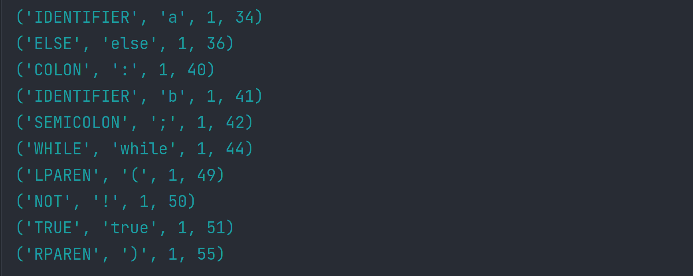

# Laboratory work Nr.3

### Course: Formal Languages & Finite Automata
### Author: Bucătaru Daniel, FAF-211

----

## Theory:
A lexer is a program that takes a sequence of characters (source code) as input and converts it 
into a sequence of tokens, which are meaningful units of the language syntax. The lexer scans the
source code and matches it against a set of predefined patterns (token definitions) to identify 
the tokens. The output of the lexer is a stream of tokens, which can be further processed by the
parser to generate an abstract syntax tree. The lexer is a crucial component of the compiler or 
interpreter for any programming language.
A lexer is a crucial part of a compiler or interpreter because it transforms the input program 
code into a stream of tokens that the following stage of compilation can readily process. 
The lexer's primary job is to search through the input program code and locate the tokens, 
which are the programming language's smallest units of meaning.

The lexer often uses regular expressions to define patterns for the many token kinds that can 
appear in the code to do this work. To match each character or group of characters to the proper 
token pattern, these regular expressions are combined into a set of rules that the lexer applies 
to the input computer code.

## Objectives:
1. Understand what lexical analysis [1] is.
2. Get familiar with the inner workings of a lexer/scanner/tokenizer.
3. Implement a sample lexer and show how it works.

## Implementation description:
* Firstly I needed to implement a lexer so I created a class:
```
class Lexer:
    def __init__(self, input_string: str, token_definitions: dict):
        self.input_string = input_string
        self.token_definitions = token_definitions
```
* Then I implemented a lexer function `lex()` that takes in the input string and a dictionary of token definitions, and returns a list of tokens.
The function first initializes an empty list of tokens, as well as a few other variables to keep track of the current position in the input string, the current line number, and the position of the start of the current line.
It then enters a loop that continues until the end of the input string is reached. In each iteration of the loop, it tries to match the input string with each token definition in the dictionary of token definitions. If a match is found, it creates a new token and adds it to the list of tokens. 
If no match is found, it raises an error. 
* The function also keeps track of the line number and position within the line, so that it can include this information in each token.
Finally, the function skips over any whitespace that may be present in the input string using the _skip_whitespace() method, and returns the list of tokens it has generated.
```
    def lex(self) -> list:
        tokens = []
        line_number = 1
        line_start_pos = 0
        pos = 0

        while pos < len(self.input_string):
            match = None
            for token_name, pattern in self.token_definitions.items():
                regex = re.compile(pattern)
                match = regex.match(self.input_string, pos)
                if match:
                    text = match.group(0)
                    if token_name != 'WHITESPACE':
                        tokens.append((token_name, text, line_number, pos - line_start_pos))
                    pos = match.end()
                    break
            if not match:
                raise ValueError(f"Invalid character '{self.input_string[pos]}' at line {line_number}, column {pos - line_start_pos}")
            if '\n' in match.group(0):
                line_number += match.group(0).count('\n')
                line_start_pos = match.end() - len(match.group(0))
            pos = self._skip_whitespace(pos)

        return tokens
```
* Next in the same class I have the function that skips the whitespaces `_skip_whitespace()` that is a helper function used by the `lex` method of the Lexer class. It takes a single parameter pos, which represents the current position in the input string.
The function then uses regular expressions to match any whitespace characters (\s) starting from the current position (pos) and returns the position of the first non-whitespace character after the matched whitespace characters.
This function is called by the lex method to skip any whitespace characters between tokens and update the position of the lexer accordingly.
```
 def _skip_whitespace(self, pos):
        return re.match(r'\s*', self.input_string[pos:]).end() + pos
```
* Next I needed the Token class where all the token expressions will be.
The `token_exprs` dictionary contains regular expressions that define the patterns for different types of tokens that can be encountered in the input string. 
Each key-value pair in the `token_exprs` dictionary represents a token name and its corresponding regular expression pattern.
Below there are some examples of the token used mere are in the class itself.
```
token_exprs = {
        'NUMBER': r'\d+(\.\d+)?',
        'PLUS': r'\+',
        'MINUS': r'\-',
        'TIMES': r'\*',
        'DIVIDE': r'/',
        'LPAREN': r'\(',
        'RPAREN': r'\)',
        'LBRACE': r'\{',
        'RBRACE': r'\}',
        'LBRACKET': r'\[',
        'RBRACKET': r'\]',
        'EQUALS': r'==',
        'NOT_EQUALS': r'!=',
       ...
    }
```
## Conclusions / Screenshots / Results

### Screenshots/Results:



### Conclusion:
In this lab, I developed a lexer using Python, a program that parses a stream of input text 
into tokens while simultaneously detecting the types of each token. The lexer is the initial 
link in the chain of parts that makes up a compiler or interpreter, and this procedure is 
crucial to compiling or interpreting programming language code.
Before creating a Python class to control the lexing procedure, I first defined a list of regular expressions 
that describe the syntax of the language I intended to lex. Lex(), the only method available in 
the class, accepts a string as input and returns a list of tokens. Each token is represented 
as a tuple that includes its name, its value, the line on which it appears in the input text, 
and its location.
I also defined a separate Token class to store the regular expressions that define the syntax of each 
type of token. This allowed me to easily add, remove or modify tokens as needed. 
The tokens I defined included numbers, operators, parentheses, braces, brackets, 
comparison operators, keywords, identifiers, and more.
In Conclusion it was an interesting lab, where I worked with the lexer and implemented it as well
as tested how it works.
### References:
[0] (https://github.com/DrVasile/FLFA-Labs/blob/master/3_LexerScanner/task.md)

[1] (https://llvm.org/docs/tutorial/MyFirstLanguageFrontend/LangImpl01.html)

[2] (https://en.wikipedia.org/wiki/Lexical_analysis)