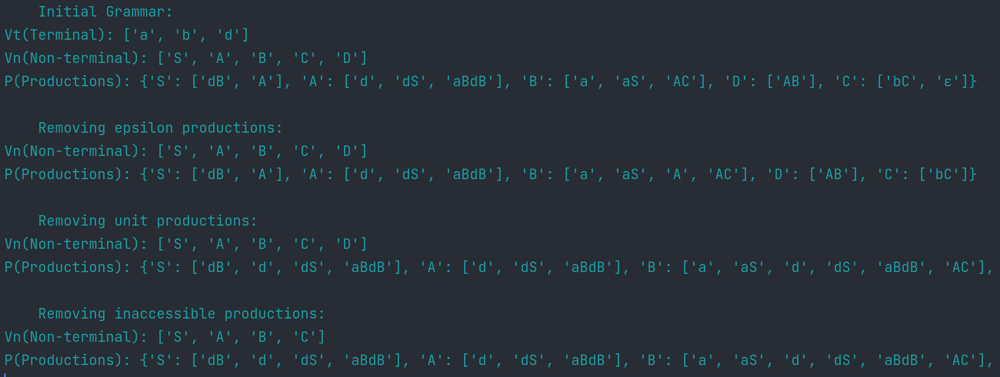
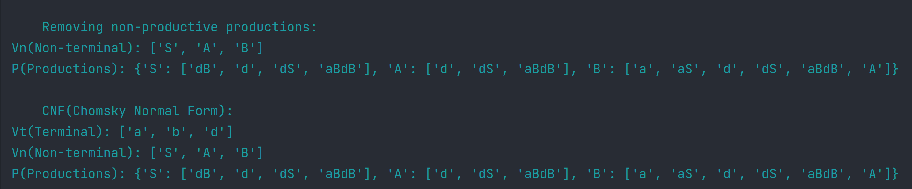

# Laboratory work Nr.4

### Course: Formal Languages & Finite Automata
### Author: Bucătaru Daniel, FAF-211

### Var. nr. : 5

----

## Theory:
Chomsky Normal Form (CNF) is a specific form of context-free grammars 
that has important properties and applications in the field of formal language 
theory and natural language processing. CNF is a restricted form of CFGs that 
imposes specific constraints on the structure of production rules, resulting in grammars 
with desirable properties such as unambiguous parsing and efficient parsing algorithms. 
In CNF, production rules are limited to two forms: A -> BC, where A, B, and C are non-terminal 
symbols, and A -> a, where A is a non-terminal symbol and a is a terminal symbol.
----
## Objectives:
1. Learn about Chomsky Normal Form (CNF).
2. Get familiar with the approaches of normalizing a grammar.
3. Implement a method for normalizing an input grammar by the rules of CNF.
    1. The implementation needs to be encapsulated in a method with an appropriate signature (also ideally in an appropriate class/type).
    2. The implemented functionality needs executed and tested.
    3. A BONUS point will be given for the student who will have unit tests that validate the functionality of the project.
    4. Also, another BONUS point would be given if the student will make the aforementioned function to accept any grammar, not only the one from the student's variant.
----
## Implementation description:
* Firstly I created a function that will return productions, terminals, non-terminals and will use
other 4 function for doing that.
```
    def to_cnf(self):
        transformations = [
            ("epsilon", self.remove_epsilon),
            ("unit", self.remove_unit),
            ("inaccessible", self.remove_inaccessible_symbols),
            ("non-productive", self.remove_non_productive_symbols),
        ]
        for name, transformation in transformations:
            transformation()
            print(f"\n\tRemoving {name} productions:\n"
                  f"Vn(Non-terminal): {self.non_terminals}\n"
                  f"P(Productions): {self.productions}")
        return self.productions, self.terminals, self.non_terminals
```
### Remove Epsilon:
* Next I have the 1st function that removes epsilon from the transition, this is the first step to
CNF. The function first identifies all the variables (non-terminal symbols) that have epsilon productions by creating 
a set 'epsilon' using a set comprehension.If the right-hand side of a production contains the epsilon symbol "ε", 
the corresponding variable is added to the epsilon set.
```
    def remove_epsilon(self):
        epsilon = set(variable for variable, productions in self.productions.items() if "ε" in productions)
        for left, right in self.productions.items():
            for i in right:
                for j in epsilon:
                    if j in i and left != j:
                        self.productions[left] = [x.replace(j, "") for x in self.productions[left]]
                        self.productions[left].append(i)
                    elif i == "ε":
                        self.productions[left].remove(i)
        return self.productions
```
### Remove Unit:
* Continue with the 2nd function that removes the unit productions.This function takes the 
 grammar and modifies its production rules to remove unit productions. 
It does so by iterating through each production rule and replacing any unit production 
with the right-hand side of the specific production. The function also handles nested unit 
productions by recursively calling itself. The modified production rules are then returned.
```
    def remove_unit(self):
        self.productions = {
            left: [r for rhs in right for r in (self.productions[rhs] if rhs in self.productions else [rhs])]
            for left, right in self.productions.items()
        }
        if any(len(right) == 1 and right[0] in self.non_terminals for right in self.productions.values()):
            self.remove_unit()
        return self.productions
```
### Remove Inaccessible Symbols:
* Next the 3rd function will remove all inaccessible symbols from the grammar. This 
function takes the grammar and removes any non-terminals (symbols) that are 
not accessible from the starting symbol. It does so by first identifying all the symbols 
that are reachable from the starting symbol by traversing the production rules. 
Then, it updates the grammar by keeping only the production rules where the left-hand side
(non-terminal) is accessible, and removes any non-terminals that are not accessible from the 
list of non-terminals.
```
    def remove_inaccessible_symbols(self):
        accessible = set(w for right in self.productions.values() for r in right for w in r)

        self.productions = {
            left: right for left, right in self.productions.items() if left in accessible
        }

        self.non_terminals = [a for a in self.non_terminals if a in accessible]
        return self.productions
```
### Remove non-Productive Symbols:
* The last 4th function removes the non-productive symbols, the last step for achieving CNF.
This function takes the grammar and removes any non-terminals symbols
that do not generate any terminal symbols. It does so by first identifying all 
the non-terminals that have at least one production rule where the right-hand side 
contains a terminal symbol.Then, it updates the grammar by keeping only the production 
rules where the left-hand side (non-terminal) is productive and removes any non-terminals that are 
not productive from the list of non-terminals.
```
    def remove_non_productive_symbols(self):
        productive = set(left for left, right in self.productions.items() if any(r in self.terminals for r in right))
        self.productions = {
            left: [
                "".join(w for w in r if w in self.terminals or w in productive)
                for r in right if len(r) == 1 or any(w in productive for w in r)
            ]
            for left, right in self.productions.items() if left in productive
        }
        self.non_terminals = [a for a in self.non_terminals if a in productive]
        return self.productions
```
## Conclusions / Screenshots / Results

### Results:
	Initial Grammar:
Vt(Terminal): ['a', 'b', 'd']
Vn(Non-terminal): ['S', 'A', 'B', 'C', 'D']
P(Productions): {'S': ['dB', 'A'], 'A': ['d', 'dS', 'aBdB'], 'B': ['a', 'aS', 'AC'], 'D': ['AB'], 'C': ['bC', 'ε']}
---
	Removing epsilon productions:
Vn(Non-terminal): ['S', 'A', 'B', 'C', 'D']
P(Productions): {'S': ['dB', 'A'], 'A': ['d', 'dS', 'aBdB'], 'B': ['a', 'aS', 'A', 'AC'], 'D': ['AB'], 'C': ['bC']}
---
	Removing unit productions:
Vn(Non-terminal): ['S', 'A', 'B', 'C', 'D']
P(Productions): {'S': ['dB', 'd', 'dS', 'aBdB'], 'A': ['d', 'dS', 'aBdB'], 'B': ['a', 'aS', 'd', 'dS', 'aBdB', 'AC'], 'D': ['AB'], 'C': ['bC']}

	Removing inaccessible productions:
Vn(Non-terminal): ['S', 'A', 'B', 'C']
P(Productions): {'S': ['dB', 'd', 'dS', 'aBdB'], 'A': ['d', 'dS', 'aBdB'], 'B': ['a', 'aS', 'd', 'dS', 'aBdB', 'AC'], 'C': ['bC']}
---
	Removing non-productive productions:
Vn(Non-terminal): ['S', 'A', 'B']
P(Productions): {'S': ['dB', 'd', 'dS', 'aBdB'], 'A': ['d', 'dS', 'aBdB'], 'B': ['a', 'aS', 'd', 'dS', 'aBdB', 'A']}
---
	CNF(Chomsky Normal Form):
Vt(Terminal): ['a', 'b', 'd']
Vn(Non-terminal): ['S', 'A', 'B']
P(Productions): {'S': ['dB', 'd', 'dS', 'aBdB'], 'A': ['d', 'dS', 'aBdB'], 'B': ['a', 'aS', 'd', 'dS', 'aBdB', 'A']}
---

### Screenshots:



### Conclusion:

In conclusion working on this laboratory work with the Chomsky Normal Form(CNF) topic was a really interesting 
experience. Taking a grammar and transforming it to CNF was not so easy how I thought will be but
after completing the task also I can say it wasn't so hard.
In this lab I learned about the process that needs to be done in order to transform a grammar to the 
CNF, and all the operation that need to be done in the right order.
All my functions work very good with my grammar var nr.5, but as well I believe other grammars will
work too. 
Implementing the CNF is a good practice for a better understanding of grammars and how to normalize them
by some specific standards.
Finally I enjoyed working on this lab it really help in understanding in depth how the grammar works
and how they are normalized.

### References:
* https://github.com/DrVasile/FLFA-Labs/blob/master/4_ChomskyNormalForm/task.md
* https://en.wikipedia.org/wiki/Chomsky_normal_form
