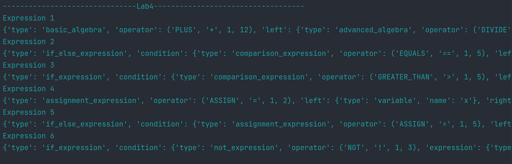

# Laboratory work Nr.5

### Course: Formal Languages & Finite Automata
### Author: Bucătaru Daniel, FAF-211

## Theory:
* A parser is a component of a compiler or interpreter that analyzes the structure of 
input code and determines whether it conforms to the grammar rules of a programming language. 
It takes a sequence of tokens, typically generated by a lexer, and constructs a data structure 
called the Abstract Syntax Tree (AST).  The primary role of a parser is to ensure that the input 
code is syntactically valid according to the language's grammar. It applies a set of parsing 
rules, often based on a formal grammar specification, to recognize the valid patterns and 
structures of the language. If the code violates the grammar rules, the parser raises an error, 
indicating the location and nature of the error.
* The Abstract Syntax Tree (AST) is a hierarchical representation of parsed code that captures 
the essential elements and relationships within the code. It provides a structured and abstracted
view of the code, omitting unnecessary details such as parentheses or semicolons.  
The AST serves as an intermediate representation, enabling further stages of compilation 
or interpretation. It abstracts the code's syntax into a tree-like structure, with each node 
representing a language construct, such as functions, loops, or assignments. 
The relationships between nodes reflect the hierarchical organization of the code.
----
## Objectives:
1. Get familiar with parsing, what it is and how it can be programmed [1].
2. Get familiar with the concept of AST [2].
3. In addition to what has been done in the 3rd lab work do the following:
   1. In case you didn't have a type that denotes the possible types of tokens you need to:
      1. Have a type __*TokenType*__ (like an enum) that can be used in the lexical analysis to categorize the tokens. 
      2. Please use regular expressions to identify the type of the token.
   2. Implement the necessary data structures for an AST that could be used for the text you have processed in the 3rd lab work.
   3. Implement a simple parser program that could extract the syntactic information from the input text.
----
## Implementation description:

* First I made a Parser Class, where all the function will be.
```
class Parser:
    def __init__(self, tokens):
        self.tokens = tokens
        self.current_token_index = 0
```
* Next the Functions, first is the `parse_primary_expression` in witch are the main tokens as 
numbers, variables, parenthesis, if else statements, boolean expressions and so on.
```
    def parse_primary_expression(self):
        token = self.current_token()
        self.advance()

        if token[0] == 'NUMBER':
            return {
                'type': 'number',
                'value': token[1]
            }
        elif token[0] == 'IDENTIFIER':
            return {
                'type': 'variable',
                'name': token[1]
            }
            ...
            if self.current_token()[0] == 'ELSE':
                self.advance()
                self.expect('COLON')
                else_expression = self.parse_expression()
                return {
                    'type': 'if_else_expression',
                    'condition': condition,
                    'if_expression': if_expression,
                    'else_expression': else_expression
                }
            ...
        elif token[0] == 'TRUE':
            return {
                'type': 'boolean',
                'value': True
            }
        elif token[0] == 'FALSE':
            return {
                'type': 'boolean',
                'value': False
            }
       ...
```
* Next there are the other functions for assign expressions `parse_assignment_expression` that 
work for assign(=), comma(,) and so on.
```
    def parse_assignment_expression(self):
        left = self.parse_comparison_expression()
        if self.current_token()[0] == 'ASSIGN':
            operator = self.current_token()
            self.advance()
            right = self.parse_comparison_expression()
            if self.current_token()[0] == 'COMMA':
                self.advance()
                right = self.parse_assignment_expression()
            left = {
                'type': 'assignment_expression',
                'operator': operator,
                'left': left,
                'right': right
            }
        return left
```
* Other functions are for comparison expressions, like: ==, !=, <,> and others.
```
    def parse_comparison_expression(self):
        left = self.parse_logical_expression()
        while self.current_token()[0] in ['EQUALS', 'NOT_EQUALS', 'LESS_THAN', 'LESS_THEN_EQUALS', 'GREATER_THAN', 'GREATER_THAN_EQUAL']:
            operator = self.current_token()
            self.advance()
            right = self.parse_logical_expression()
            left = {
                'type': 'comparison_expression',
                'operator': operator,
                'left': left,
                'right': right
            }
        return left
```
* For logical expressions and of course the math(+, -, *, /) and so on. The logical expressions
uses function uses the addition expressions to parse the left side of the expressions and asing
all to the `left` varaible.

```
    def parse_logical_expression(self):
        left = self.parse_addition_expression()

        while self.current_token()[0] in ['AND', 'OR', 'NOT']:
            if self.current_token()[0] == 'NOT':
                operator = self.current_token()
                self.advance()

                expression = self.parse_addition_expression()
            ...
```

```
    def parse_addition_expression(self):
        left = self.parse_multiplication_expression()
        while self.current_token()[0] in ['PLUS', 'MINUS']:
            operator = self.current_token()
            self.advance()

            right = self.parse_multiplication_expression()

            left = {
                'type': 'basic_algebra',
                'operator': operator,
                'left': left,
                'right': right
            }
        return left
```
* And the implementation for multiplication and division(*, /). More in the Parser class code!
```
    def parse_multiplication_expression(self):
        left = self.parse_primary_expression()
        while self.current_token()[0] in ['TIMES', 'DIVIDE']:
            operator = self.current_token()
            self.advance()
            right = self.parse_primary_expression()
            left = {
                'type': 'advanced_algebra',
                'operator': operator,
                'left': left,
                'right': right
            }
        return left
```

## Conclusions / Screenshots / Results

## Results:
#### String Input 1: "(x - 2) / 1 + 2 / 3"
* `Expression 1`
{'type': 'basic_algebra', 'operator': ('PLUS', '+', 1, 12), 'left': {'type': 'advanced_algebra', 'operator': ('DIVIDE', '/', 1, 8), 'left': {'type': 'basic_algebra', 'operator': ('MINUS', '-', 1, 3), 'left': {'type': 'variable', 'name': 'x'}, 'right': {'type': 'number', 'value': '2'}}, 'right': {'type': 'number', 'value': '1'}}, 'right': {'type': 'advanced_algebra', 'operator': ('DIVIDE', '/', 1, 16), 'left': {'type': 'number', 'value': '2'}, 'right': {'type': 'number', 'value': '3'}}}
#### String Input 2: 'if 2 == 0: 2 else: 2 * 1'
* `Expression 2`
{'type': 'if_else_expression', 'condition': {'type': 'comparison_expression', 'operator': ('EQUALS', '==', 1, 5), 'left': {'type': 'number', 'value': '2'}, 'right': {'type': 'number', 'value': '0'}}, 'if_expression': {'type': 'number', 'value': '2'}, 'else_expression': {'type': 'advanced_algebra', 'operator': ('TIMES', '*', 1, 21), 'left': {'type': 'number', 'value': '2'}, 'right': {'type': 'number', 'value': '1'}}}
#### String Input 3: "if x > 5: result = 1"
* `Expression 3`
{'type': 'if_expression', 'condition': {'type': 'comparison_expression', 'operator': ('GREATER_THAN', '>', 1, 5), 'left': {'type': 'variable', 'name': 'x'}, 'right': {'type': 'number', 'value': '5'}}, 'if_expression': {'type': 'assignment_expression', 'operator': ('ASSIGN', '=', 1, 17), 'left': {'type': 'variable', 'name': 'result'}, 'right': {'type': 'number', 'value': '1'}}}
#### String Input 4: "x = 10 + 5 * (2 - 1); y = x > 10"
* ` Expression 4`
{'type': 'assignment_expression', 'operator': ('ASSIGN', '=', 1, 2), 'left': {'type': 'variable', 'name': 'x'}, 'right': {'type': 'basic_algebra', 'operator': ('PLUS', '+', 1, 7), 'left': {'type': 'number', 'value': '10'}, 'right': {'type': 'advanced_algebra', 'operator': ('TIMES', '*', 1, 11), 'left': {'type': 'number', 'value': '5'}, 'right': {'type': 'basic_algebra', 'operator': ('MINUS', '-', 1, 16), 'left': {'type': 'number', 'value': '2'}, 'right': {'type': 'number', 'value': '1'}}}}}
#### String Input 5: "if x = true: x = 1 else: y = false"
* `Expression 5`
{'type': 'if_else_expression', 'condition': {'type': 'assignment_expression', 'operator': ('ASSIGN', '=', 1, 5), 'left': {'type': 'variable', 'name': 'x'}, 'right': {'type': 'boolean', 'value': True}}, 'if_expression': {'type': 'assignment_expression', 'operator': ('ASSIGN', '=', 1, 15), 'left': {'type': 'variable', 'name': 'x'}, 'right': {'type': 'number', 'value': '1'}}, 'else_expression': {'type': 'assignment_expression', 'operator': ('ASSIGN', '=', 1, 27), 'left': {'type': 'variable', 'name': 'y'}, 'right': {'type': 'boolean', 'value': False}}}
#### String Input 6: "if !x && y || x && !y = true: x = 1"
* `Expression 6`
{'type': 'if_expression', 'condition': {'type': 'not_expression', 'operator': ('NOT', '!', 1, 3), 'expression': {'type': 'logical_expression', 'operator': ('AND', '&&', 1, 16), 'left': {'type': 'logical_expression', 'operator': ('OR', '||', 1, 11), 'left': {'type': 'logical_expression', 'operator': ('AND', '&&', 1, 6), 'left': {'type': 'variable', 'name': 'x'}, 'right': {'type': 'variable', 'name': 'y'}}, 'right': {'type': 'variable', 'name': 'x'}}, 'right': {'type': 'not_expression', 'operator': ('NOT', '!', 1, 19), 'expression': {'type': 'assignment_expression', 'operator': ('ASSIGN', '=', 1, 22), 'left': {'type': 'variable', 'name': 'y'}, 'right': {'type': 'boolean', 'value': True}}}}}, 'if_expression': {'type': 'assignment_expression', 'operator': ('ASSIGN', '=', 1, 32), 'left': {'type': 'variable', 'name': 'x'}, 'right': {'type': 'number', 'value': '1'}}}

### Screenshots:


### Conclusion:
    
In conclusion in the 5th, last laboratory work, I learned the Parser implementation for an already
existing lexer and token that there took from the previous lab 3. I understood what is AST, and 
how to implement. I already had a TokenType, that was created for lab 3, so I used what I already had
the TokenType is in the Lexer folder, it is named just 'token'.
Next I understood how the lexer, parser and the AST work together, and what are their roles separately
and together so that the output will be good with minimal errors.
Also I enjoyed working on all 5 labs that finally created a good working code that have implementations
from a Grammar to the parser that I did in the last lab. It was cool working in this way and of course
structuring my repository accordingly.
Finally it this lab was a good experience with the Parser implementation and as a whole it was a 
fun experience working this way.

### References:
* https://github.com/DrVasile/FLFA-Labs/blob/master/5_ParserASTBuild/task.md
* https://en.wikipedia.org/wiki/Parsing
* https://en.wikipedia.org/wiki/Abstract_syntax_tree
